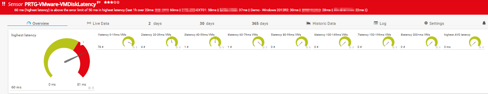

# PRTG-VMware-VMDiskLatency
# About

## Project Owner:

Jannos-443

## Project Details

Using VMWare PowerCLI this Script checks VMware VM Disk Latency

## HOW TO

1. Make sure the VMware PowerCLI Module exists on the Probe under the Powershell Module Path
   - `C:\Program Files\WindowsPowerShell\Modules\VMware.VimAutomation.Core`

2. Place `PRTG-VMware-VMDiskLatency.ps1` under `C:\Program Files (x86)\PRTG Network Monitor\Custom Sensors\EXEXML`

3. Create new Sensor

   | Settings | Value |
   | --- | --- |
   | EXE/Script | PRTG-VMware-VMDiskLatency.ps1 |
   | Parameters | -ViServer 'yourVCenter' -User 'yourUser' -Password 'yourPassword' |
   | Scanning Interval | 15 minutes |

4. Set the "$IgnorePattern", "$ExcludeFolder" or "ExcludeRessource" Parameter to exclude VMs
   
   example: `-IgnorePattern '^(Test-VM-123)$'`
 
5. Optional change default Parameter LimitMAX (default = 20ms) and TimeMAX (default = 1 hour)

	LimitMAX: All VMs with latency above this limit will be in the PRTG Message (Alert Limit can be controlled with the Channel Limit)
	
	TimeMAX: 1 means that the Script searches the Max latency from the last 1 hour
	
	

## Examples

VM exceptions
------------------
Exceptions can be made within this script by changing the variable **IgnoreScript**. This way, the change applies to all PRTG sensors 
based on this script. If exceptions have to be made on a per sensor level, the script parameter **IgnorePattern** can be used.

For more information about regular expressions in PowerShell, visit [Microsoft Docs](https://docs.microsoft.com/en-us/powershell/module/microsoft.powershell.core/about/about_regular_expressions).

".+" is one or more charakters
".*" is zero or more charakters
